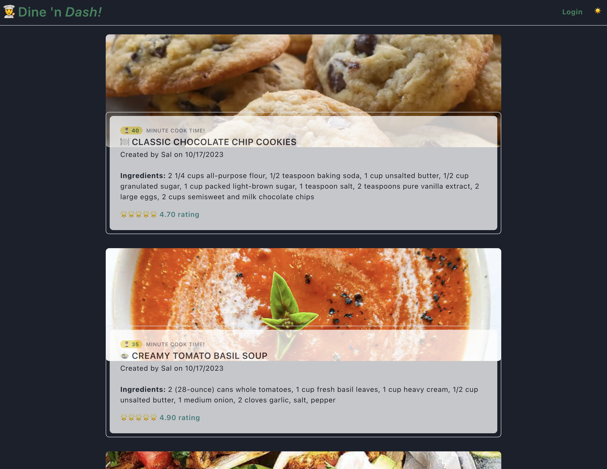

# Dine 'n Dash
To give the everyday people an easy way to save and share their recipes with other people. Dine ’n Dash makes dining in fun, easy and affordable. Here you can find new and innovative recipes to enhance your dish or give it a fresh new twist.

  

# Description
This is a recipe application that can be used for storing everyday recipes and meal instructions. For personal use, and to share!

# Features
* Create a user profile
* Digital recipe book to save your favorite recipes
* Cook and review other people's recipes  
* Light/dark mode for account users

# User Story
AS A regular person, I want a digital recipe book  
SO THAT I can easily access, add, share, and rate my favorite recipes  
GIVEN THAT I want to start cooking more  
WHEN I create a new recipe, it displays on my profile page so that I can always find it, and when I try other people's recipes, I can rate them  
THEN I can explore and enhance my culinary skills, creating a vibrant cooking community through Dine 'n Dash, and ultimately transform my everyday meals into exciting, memorable dining in experiences

# Acceptance Criteria
* The app should provide a user-friendly digital recipe book for regular users.
* Users should be able to easily access, add, share, and rate their favorite recipes on the app.
* The app should take into consideration the user's desire to cook more often.
* When a user creates a new recipe, it should automatically display on their profile page for easy access.
* Users should have the ability to rate and provide feedback on recipes shared by other community members.
* The app should enable users to explore and enhance their culinary skills.
Dine 'n Dash should facilitate the creation of a vibrant cooking community.
* The app should ultimately help users transform their everyday meals into exciting and memorable dining experiences.

# How to Use
If you want to see this website on your own computer, follow these simple steps:
1. Clone the repository: Click on the "Code" button above and select "Download ZIP" 
2. Extract the ZIP file to your computer
3. Add an .env file
4. Install dependencies (npm install)
5. Run MySQL
6. Seed database
7. Start the server
8. Run localhost on the browser  

GitHub Link: https://github.com/MatthewChappelle/Dine_In_Dash/  

Heroku Link: https://dinendash-66e7246af15f.herokuapp.com/

# Resources 
* Node.js
* Express.js
* MySql
* Tailwind CSS
* Class materials
* GitHub - tailwindtoolbox
* YouTube tutorials
* Heroku
* Freepik.com (images from chadlervid85 and valeria.aksakova)

# License
No license at the moment.
